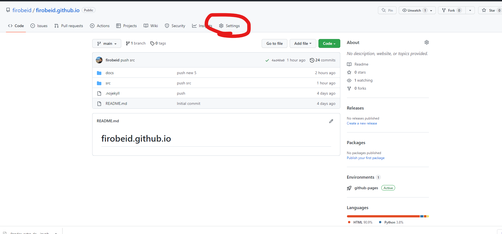
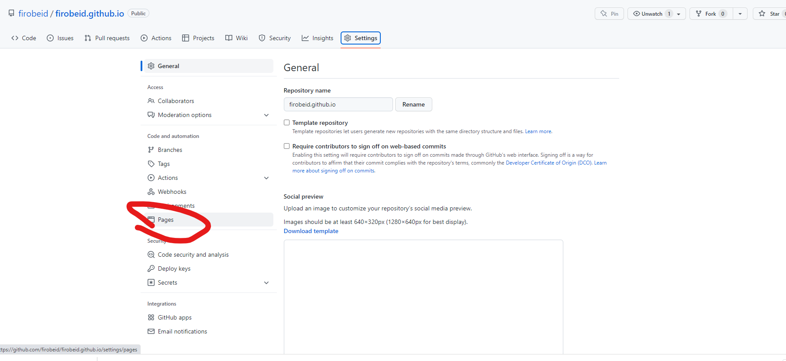
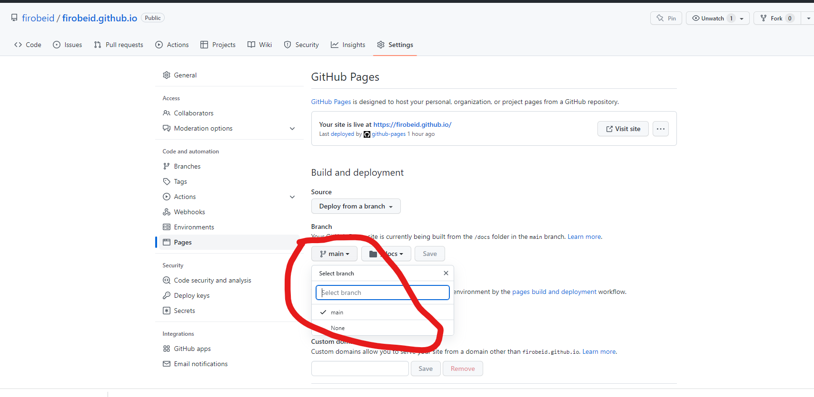
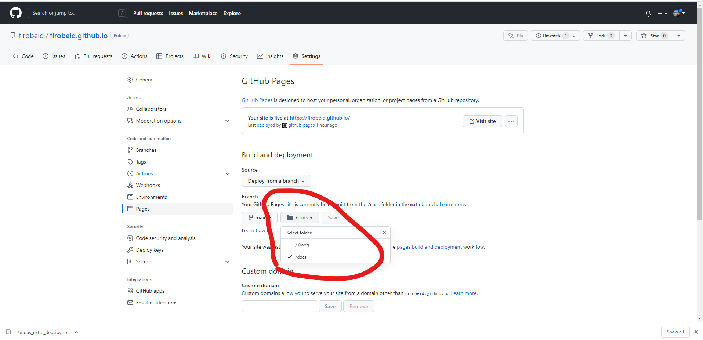
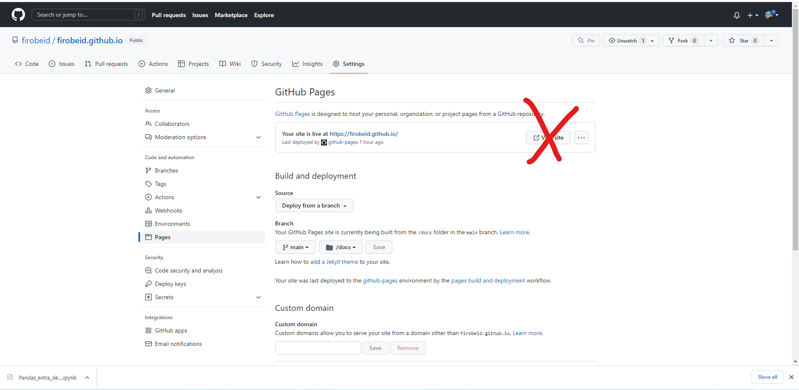

# Github Dashboards Deploy  

## Objective
Deploy your dashboards easily to github pages through converting your python code to web assembly language. Once converted the dashboard is then deployed to git hub and will run real time on any browser that opens that deployment link. This is a new promising technique that will make us not need server based deplyments.

My deployment that is live based on your class activities: [Press Me](https://firobeid.github.io/compose-plots/script.html)

## Enviroment Creation Steps
Please follow instructions in your terminal as follows:
* `conda create -n testing python=3.7`
* `conda activate testing`
* `conda install -c pyviz hvplot geoviews`
* `pip install -r requirements.txt`

## Deployment Prepration Steps
1. Create new github repo
2. Clone your public repo locally and cd into it
3. Copy everything from Instructor-Extra-Resources/Deploy_Dashboards and paste in your local repo
4. cd into github folder you just pasted everything inside too
4. Type in the terminal `touch .nojekyll`
5. `conda activate testing`
6. cd into src and cd into a project off your choice `panel serve script.py --autoreload`
7. `panel convert src/project-name/script.py --to pyodide-worker --out docs/project-name` for each project you have in src folder
8. git status --> git add. --> git commit -m "..." --> git push
9. Go to your github repo where you pushed too and press Settings as shown below:

10. Press on pages tab as shown below:

11. Press under branch and select main as shown below

12. Change /root into /docs as shown below

13. You are all set!! Refresh the page and wait few minutes and then you can acess your deployments but dont press the link below as it will give 404 error:

14. Deployment links should look like this:

https://YOUR_GITHUB_USERNAME.github.io/YOUR_GITHUB_REPO/hello-world/script.html

https://YOUR_GITHUB_USERNAME.github.io/YOUR_GITHUB_REPO/compose-plots/script.html

https://YOUR_GITHUB_USERNAME.github.io/YOUR_GITHUB_REPO/portfolio-optimizer/script.html

Offcourse replace `YOUR_GITHUB_USERNAME` & `YOUR_GITHUB_REPO` with your username and what you names your repo respectively!

## Recording
Please fast forward when necessary:
[Deploy Demo Recording](https://zoom.us/rec/share/zsisyqlyEKT3AAVGR83UNB1rbOviF3W9oZJhZrqPVScPOpaAP3xTm-bZ2KLA5QbO.173WwTK4Y0f8HfiX?startTime=1667440991000)

## Resource Links
[Panel Release for the Intiative](https://blog.holoviz.org/panel_0.14.html)

[Holovis main site](https://blog.holoviz.org/panel_0.14.html)

[Panel Github Page](https://github.com/holoviz/panel)

Highly Recommended!!:
[Dashboard Examples with Source Code](https://examples.pyviz.org/index.html)